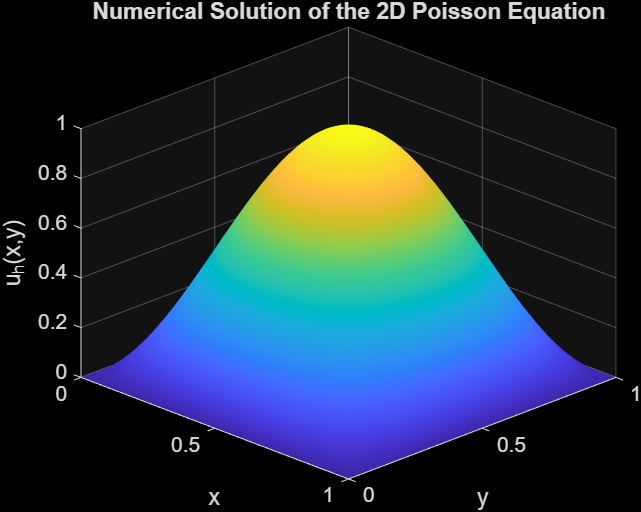
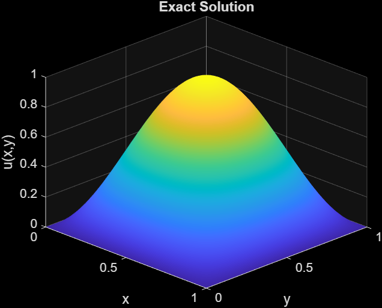
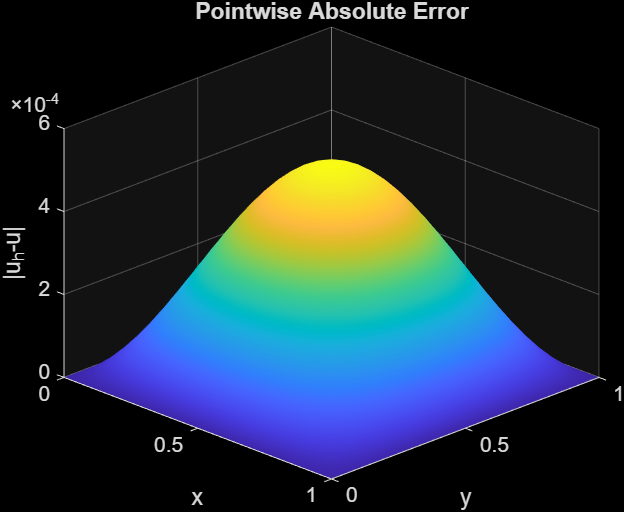
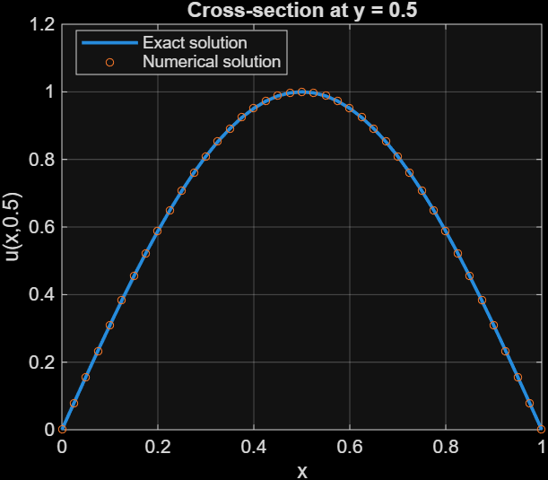
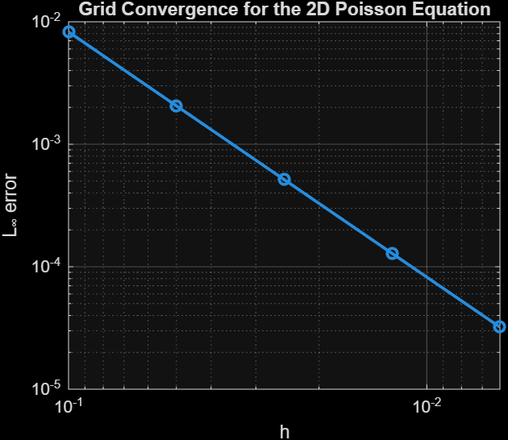
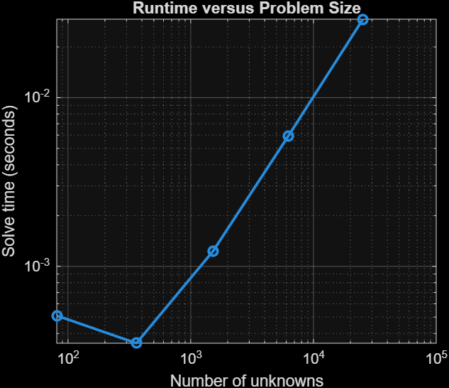
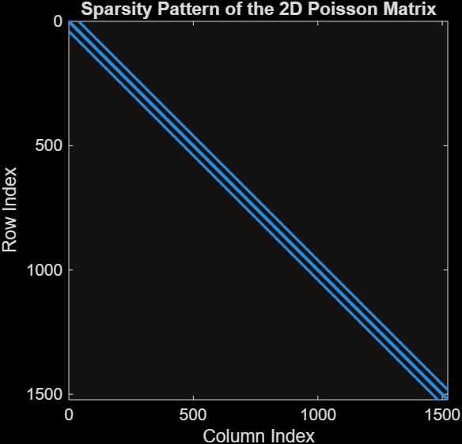

# 2D Poisson Equation Using Finite Differences

This project solves a two-dimensional Poisson equation on the unit square using the standard five-point finite difference method in MATLAB. The numerical solution is compared with a known exact solution, and the project also studies grid convergence, computational cost, and the sparsity structure of the resulting linear system.

---

## Mathematical Model

The problem is

$$
-\Delta u = f
$$

on the unit square

$$
\Omega = (0,1)\times(0,1),
$$

with homogeneous Dirichlet boundary conditions

$$
u = 0 \qquad \text{on } \partial\Omega.
$$

The exact solution is chosen as

$$
u(x,y) = \sin(\pi x)\sin(\pi y).
$$

Therefore,

$$
f(x,y) = 2\pi^2 \sin(\pi x)\sin(\pi y).
$$

Using a known exact solution makes it possible to directly measure the numerical error.

---

## Numerical Method

The Laplacian is approximated at an interior grid point using the five-point stencil:

$$
-\Delta u(x_i,y_j)
\approx
\frac{
4u_{i,j}
-
u_{i+1,j}
-
u_{i-1,j}
-
u_{i,j+1}
-
u_{i,j-1}
}{h^2}.
$$

Applying this approximation at all interior grid points converts the PDE into a sparse linear system

$$
A\mathbf{u} = \mathbf{b}.
$$

The system is assembled using MATLAB sparse matrices and solved with MATLAB's backslash operator.

---

## Numerical Solution

For $N=41$, the grid contains $39\times39 = 1521$ interior unknowns.

The numerical solution closely matches the exact solution.





The pointwise absolute error is shown below.



A cross-section at $y=0.5$ also shows close agreement between the numerical and exact solutions.



---

## Grid Convergence Study

The grid was refined from $N=11$ to $N=161$.

| N | h | Unknowns | L-infinity Error | Observed Order |
|---:|---:|---:|---:|---:|
| 11 | 0.10000 | 81 | 8.2654e-03 | — |
| 21 | 0.05000 | 361 | 2.0587e-03 | 2.0053 |
| 41 | 0.02500 | 1521 | 5.1420e-04 | 2.0013 |
| 81 | 0.01250 | 6241 | 1.2852e-04 | 2.0003 |
| 161 | 0.00625 | 25281 | 3.2128e-05 | 2.0001 |

The observed convergence rate approaches

$$
p \approx 2,
$$

which is consistent with the expected second-order accuracy of the five-point finite difference approximation.



---

## Computational Cost

To obtain a more stable timing measurement, each grid size was solved 10 times and the average runtime was recorded.

| N | Unknowns | Average Runtime (s) |
|---:|---:|---:|
| 11 | 81 | 5.1040e-04 |
| 21 | 361 | 3.5010e-04 |
| 41 | 1521 | 1.2317e-03 |
| 81 | 6241 | 5.9271e-03 |
| 161 | 25281 | 2.91851e-02 |

For very small systems, timing is affected by MATLAB overhead and other small variations. For the larger systems, the increase in computational cost becomes clear as the number of unknowns grows.



---

## Sparse Matrix Structure

The finite difference discretization produces a sparse matrix because each interior grid point is coupled only to itself and its neighboring grid points.

For $N=41$:

- number of unknowns: 1521
- entries in a corresponding dense matrix: 2,313,441
- nonzero entries in the sparse matrix: 7,449

The sparsity pattern is shown below.



This illustrates why sparse matrix storage is important when solving larger PDE systems.

---

## Project Files

```text
2D-Poisson-Finite-Difference/
│
├── main_poisson2d.m
├── poisson2d_fd.m
├── convergence_poisson2d.m
├── README.md
│
├── results/
│   ├── numerical_solution_N41.png
│   ├── exact_solution_N41.png
│   ├── error_N41.png
│   ├── cross_section_N41.png
│   ├── numerical_solution_N81.png
│   ├── exact_solution_N81.png
│   ├── error_N81.png
│   ├── cross_section_N81.png
│   ├── convergence.png
│   ├── runtime.png
│   └── sparsity_pattern.png
│
└── report/
    └── Poisson_2D_Finite_Difference_Report.pdf
```

---

## How to Run

Open the project folder in MATLAB.

Run the main numerical experiment with

```matlab
main_poisson2d
```

Run the grid convergence and runtime study with

```matlab
convergence_poisson2d
```

The grid size can be changed by modifying `N` in `main_poisson2d.m`.

---

## Main Results

The main observations from this project are:

- the finite difference solution agrees closely with the analytical solution;
- grid refinement gives an observed convergence rate very close to second order;
- the number of unknowns grows rapidly as the two-dimensional grid is refined;
- computational time increases noticeably for larger systems;
- the five-point discretization produces a highly sparse linear system.

---

## Software

MATLAB

---

## Report

A short report for this project is included in:

```text
report/Poisson_2D_Finite_Difference_Report.pdf
```

---

## Author

**Md Mostafa**  
Ph.D. Student in Mathematics  
University of North Texas
